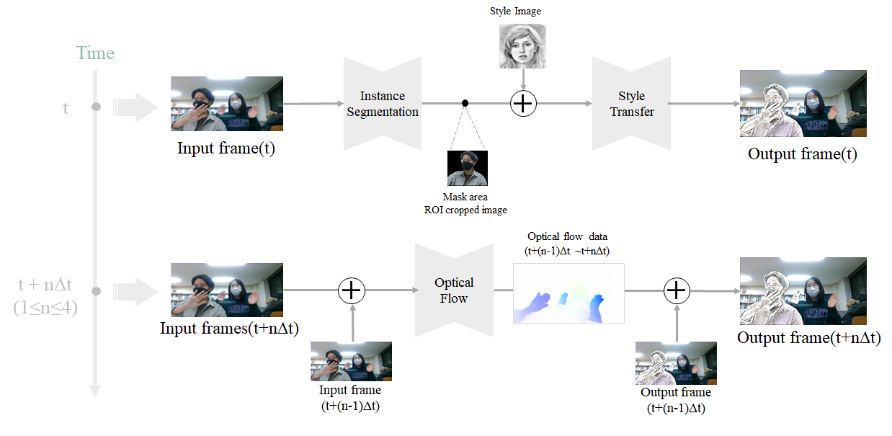

# 박물관을 넘어 도망친 화가들

### 1675022 김현지, 1675037 송지언, 1772150 여화선 
#### 2020-2 전자공학종합설계 

The team worked on a project to convert texture in a desired image style by selecting the specific object from the video taken with a webcam. The final output is obtained by segmentation of the image and converting only the selected object into the desired texture like the masterpiece. In order to run the network in fast speed, the viewpoint of video processing was incorporated into existing studies. The optical flow was created by grouping several frames, and the first frame was instantiated and then the mask area image was set. After that, the mask area image was used as a new input to go through style transfer. The segmentation and style transfer of the remaining frames were predicted by using the optical flow between this first frame and each of the remaining frames, and then made into a video. The use of optical flow and style transfer of only the detected ROI area reduces the amount of network computation and enables real-time processing. This algorithm has proven that real-time processing is possible with results of up to 29.45fps. Such research can be used as an experience tool in museums and art galleries, and can be extended to the automotive industry in the future.




### Test enviroment
Cuda cimpiler driver : 10.0
Cuda Version : 11.1
Python 3.6.9
Pytorch : 1.1.0
Torchvision : 0.3.0

To test the code, you have to set up the environment of below networks, and download weights.

### Set up the enviroment
[YOLACT](https://github.com/dbolya/yolact), [Learning Linear Transformations for Fast Arbitrary Style Transfer](https://github.com/sunshineatnoon/LinearStyleTransfer), [FlowNet2.0](https://github.com/NVIDIA/flownet2-pytorch)

### Download Weights
1. from [YOLACT](https://github.com/dbolya/yolact) and put the corresponding weights file in the `./weights` directory
2. from [FlowNet2.0](https://github.com/NVIDIA/flownet2-pytorch) and put the corresponding weights file in the `./model` directory


```
python3 ARTists.py --trained_model=weights/yolact_base_54_800000.pth --score_threshold=0.15 --top_k=15 --video_multiframe=5 --video=0 --vgg_dir models/vgg_r31.pth --decoder_dir models/dec_r31.pth --matrixPath models/r31.pth --layer r31 --model FlowNet2S --resume model/FlowNet2-S_checkpoint.pth.tar --class_name person0 --style data/style/gogh.jpg 

```


### References
We used pretrained networks below

```
@article{yolact-plus-tpami2020,
  author  = {Daniel Bolya and Chong Zhou and Fanyi Xiao and Yong Jae Lee},
  journal = {IEEE Transactions on Pattern Analysis and Machine Intelligence}, 
  title   = {YOLACT++: Better Real-time Instance Segmentation}, 
  year    = {2020},
}

@inproceedings{li2018learning,
    author = {Li, Xueting and Liu, Sifei and Kautz, Jan and Yang, Ming-Hsuan},
    title = {Learning Linear Transformations for Fast Arbitrary Style Transfer},
    booktitle = {IEEE Conference on Computer Vision and Pattern Recognition},
    year = {2019}
}

@misc{flownet2-pytorch,
  author = {Fitsum Reda and Robert Pottorff and Jon Barker and Bryan Catanzaro},
  title = {flownet2-pytorch: Pytorch implementation of FlowNet 2.0: Evolution of Optical Flow Estimation with Deep Networks},
  year = {2017},
  publisher = {GitHub},
  journal = {GitHub repository},
  howpublished = {\url{https://github.com/NVIDIA/flownet2-pytorch}}
}
```
